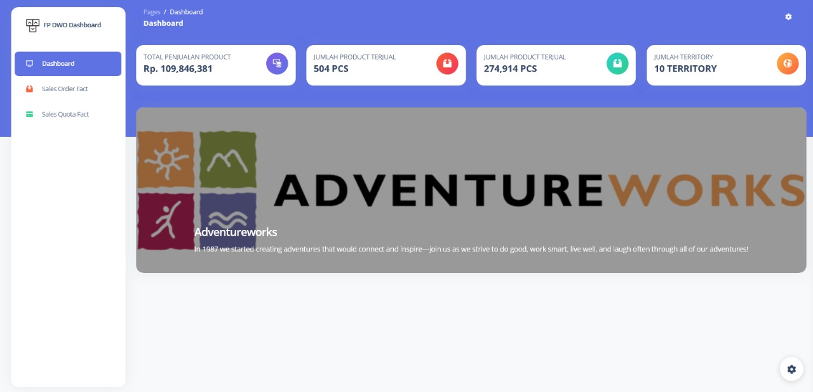
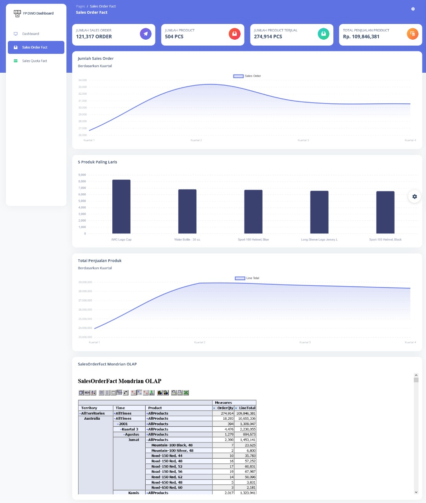
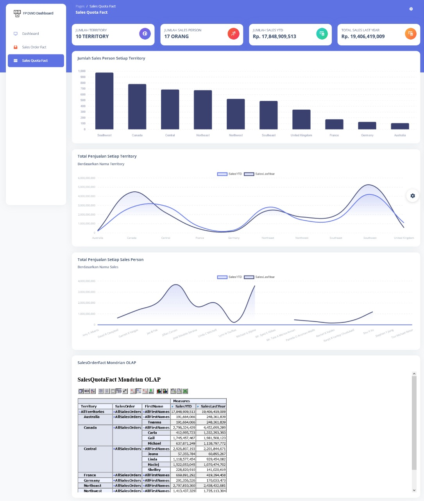

# FP_DWO_KELOMPOK_18

FINAL PROJECT MATA KULIAH DATA WAREHOUSE - SEMESTER 6

Perkenalkan kami dari kelompok 18 Paralel B yang terdiri dari :
1. Real Ananda Kristi			[19082010003]
2. Siti Lailatul Zahrotun Nisak	[19082010035]
3. Fajar Wirahadi Kusuma	 	[19082010072] (Ketua Kelompok)
4. Yusman Zulfandra F. R		[19082010082]
5. Inas Syarifah Abidah			[19082010089]

Langkah-langkah yang dibutuhkan untuk menjalankan app dengan baik :

1. Install database server: MySql (disini kami menggunakan XAMPP versi terbaru).
2. Install software mysql management: phpMyAdmin dari XAMPP (ATAU YG LAIN).
3. Extract FP_DWO_KELOMPOK_18.zip pada folder htdocs XAMPP (xampp/htdocs).
4. Jalankan XAMPP control panel.
5. Start apache,mysql server, dan tomcat.
6. Buka phpMyAdmin (http://localhost/phpmyadmin).
7. Buat database dengan nama fp_dwo.
8. Import file fp_dwo.sql ke dalam database fp_dwo.
9. Pindahkan file jsp dan xml (salesorderfact, salesquotafact) yang ada pada folder mondrian pindahkan kedalam folder  -> C:\xampp\tomcat\webapps\mondrian\WEB-INF\queries.
10. Pindahkan file testpage.jsp dan index (jsp, html) yang ada pada folder mondrian pindahkan kedalam folder -> C:\xampp\tomcat\webapps\mondrian.
11. Jalankan aplikasi dengan mengakses http://localhost/FP_DWO_KELOMPOK_18/.

# Screenshot 
## Dashboard Menu

## SalesOrderFactMenu

## SalesQuotaFactMenu

Made with &hearts; in Surabaya • Powered by Kelompok 18
